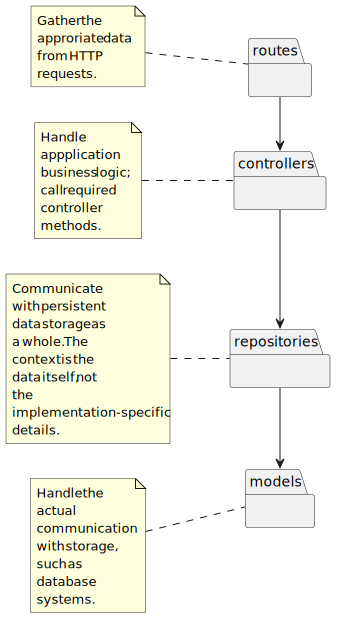
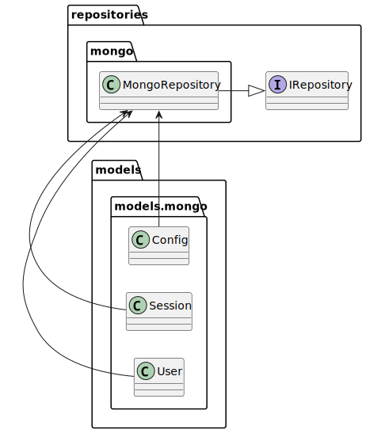

# Server architecture

The server codebase follows the MVCS pattern. Thus, server has the model, reposisory (store), and model layers. The diagram below is an overview of the packages contained within server.

## Controllers

Controllers handle the business logic of the application. It is their responsibility to call the appropriate repository methods to achieve the functionality required.
Base class for controllers is the `Controller` class. It takes a repository class as an argument when instantiaing, providing customization when it comes to the database.
For example, a mock repository may be passed to a controller when writing unit tests, instead of the actual database repository.
## Repositories

Repositories take care of the communication with database systems. They encapsulate provider-specific implementation details, and offer a generic API similar to MongoDB. The API is provided by the `IRepository` interface. Concrete repository classes that implemeent the `IRepository` interface must implement the methods it declares. Concrete repositories encapsulate the non-portable implementation details behind a common API.

Repositoriy methods return the generic Model types. No matter what database is user under the hood, the same kind of models are always returned. Models can't be
explicitly used to modify the state of the database. They represent the data as read-only; all modifications must happen implicitly within the repository methods.

## Models

There is an interface `IModel` that provides bare bones common structure for other models. It only has
an optional `id` field. Other model interfaces representing a concerete entity extends this model. Mere
function of these interfaces is to hide implementation details of the database systems. This helps
when using different database systems and mocking other parts of the application when developing unit tests.

Provider-dependent declarations (e.g. database schemas) should be placed under subdirectory
specific to that provider. For example, there is now the `mongo` subdirectory inside the
`models` directory containing Mongoose schemas and models.
